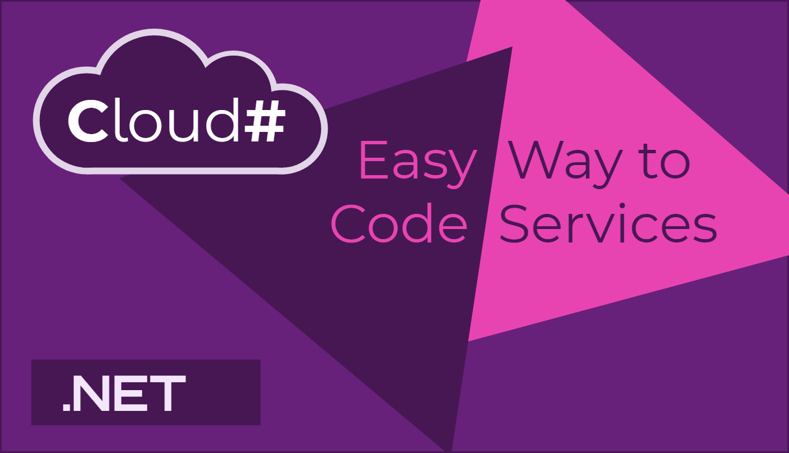

[D-ASYNC](https://github.com/Dasync/Dasync) CloudSharp is an extension to C# language that introduces new paradigms of service-oriented cloud programming. The new syntax removes the need to use or to create a framework for service APIs, inter-service communication, workflows, and state management. 

## Concepts

The basic concepts define a `serivce` and its `contract`, most common communication primitives: `query`, `command`, `event`, `event handler`.

#### Service Contract (API Surface)

```csharp
// A service API contract that is transpiled into an interface.

service contract IUserService
{
  query List<User> GetActiveUsers();
  
  command void Register(string name, string email);
  
  command bool SuspendUser(string userId);
  
  event EventHandler<User> UserRegistered;
}
```

#### Service Logic, Event Publishing

```csharp
// A service implementation that is transpiled into a class.

service UserService : IUserService
{
  command void Register(string name, string email)
  {
    var user = new User(name, email);
    
    // .....
    
    // Publish an event.
    
    publish UserRegistered(this, user);
  }
}
```

#### Event Handlers

```csharp
service RewardService
{
  public RewardService(IUserService userService)
  {
    // Subscribe to an event of another service.
    
    subscribe OnUserRegistered to userService.UserRegistered;
  }
  
  // An event handler.
  
  handler OnUserRegistered(object sender, User user)
  {
     // .....
  }
}
```

#### Persisted Workflows

```csharp
service OrderService
{
  command ProcessOrder(Order order)
  {
    // The variable is saved as a part of the execution state.
    
    persisted Guid transactionId = Guid.NewGuid();
    
    // Save execution state of this method when invoke the command.
    
    follow ProcessPayment(order, transactionId);
    
    try
    {
      follow ReserveItems(order);
    }
    catch (OutOfStockException)
    {
      // Use saved transaction ID to guarantee idempotency.
    
      follow CancelPayment(transactionId);
      
      throw;
    }
    
    follow ShipItems(order);
  }
  
  command ProcessPayment(Order order, Guid transactionId) { ..... }
  
  command CancelPayment(Guid transactionId) { ..... }
  
  command ReserveItems(Order order) { ..... }
  
  command ShipItems(Order order) { ..... }
}
```
